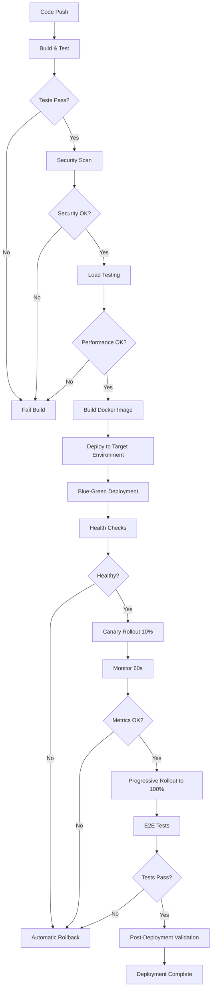

# TradeMaster Trading Service Deployment Guide

## Overview

Complete deployment automation guide for TradeMaster Trading Service with CI/CD pipelines, blue-green deployment, and comprehensive validation.

**Deployment Strategy**: Blue-Green with Canary Rollout
**Deployment Time**: 10-15 minutes (with 5-minute monitoring)
**Rollback Time**: < 5 minutes
**Zero-Downtime**: ✅ Guaranteed

---

## Table of Contents

1. [Prerequisites](#prerequisites)
2. [CI/CD Pipeline](#cicd-pipeline)
3. [Deployment Workflow](#deployment-workflow)
4. [Manual Deployment](#manual-deployment)
5. [Rollback Procedures](#rollback-procedures)
6. [Monitoring](#monitoring)
7. [Troubleshooting](#troubleshooting)

---

## Prerequisites

### Required Tools
- **Docker**: 20.10+
- **Docker Compose**: 2.0+
- **Git**: 2.30+
- **GitHub CLI**: 2.0+
- **AWS CLI**: 2.0+ (for production)
- **kubectl**: 1.24+ (optional, for Kubernetes)
- **jq**: 1.6+ (for JSON parsing)
- **curl**: 7.68+

### Required Secrets

Configure the following secrets in GitHub Actions or your CI/CD platform:

```bash
# GitHub Repository Secrets
AWS_ACCESS_KEY_ID              # AWS credentials for deployment
AWS_SECRET_ACCESS_KEY          # AWS credentials for deployment
SONAR_TOKEN                    # SonarQube authentication
SONAR_HOST_URL                 # SonarQube server URL
SLACK_WEBHOOK_URL              # Slack notifications
PAGERDUTY_SERVICE_KEY          # PagerDuty integration
GITHUB_TOKEN                   # GitHub API access (auto-provided)
```

### Environment Variables

```bash
# Deployment Configuration
export ENVIRONMENT="production"
export IMAGE_TAG="$(git rev-parse --short HEAD)"
export PROMETHEUS_URL="https://prometheus.trademaster.com"

# Test Credentials (for smoke tests)
export TEST_USER="test@trademaster.com"
export TEST_PASSWORD="your-test-password"
export TEST_USER1="user1@trademaster.com"
export TEST_PASSWORD1="your-test-password-1"
export TEST_USER2="user2@trademaster.com"
export TEST_PASSWORD2="your-test-password-2"
```

---

## CI/CD Pipeline

### GitHub Actions Workflow

The automated CI/CD pipeline is triggered on:
- **Push to `main` branch**: Deploys to production
- **Push to `develop` branch**: Deploys to staging
- **Push to `release/**` branches**: Creates release candidates
- **Pull requests**: Runs tests and quality gates

### Pipeline Jobs

```yaml
1. Build & Test (5-10 minutes)
   - Java 24 compilation
   - Unit tests (>80% coverage)
   - Integration tests (>70% coverage)
   - JaCoCo test reports

2. Security Scan (10-15 minutes)
   - OWASP Dependency Check (CVSS ≥ 7.0 fails build)
   - SonarQube analysis
   - Quality gate validation

3. Load Testing (15-20 minutes) [main/develop only]
   - Gatling performance tests
   - 5K-15K concurrent users
   - P95 < 200ms, P99 < 500ms

4. Build Docker Image (5-10 minutes)
   - Multi-stage Docker build
   - Image push to GitHub Container Registry
   - Trivy security scan

5. Deploy to Staging (5-10 minutes) [develop branch]
   - Blue-green deployment
   - Smoke tests
   - Slack notification

6. Deploy to Production (15-20 minutes) [main branch]
   - Pre-deployment quality gates
   - Database backup
   - Blue-green deployment with canary (10%)
   - Health monitoring (5 minutes)
   - Progressive rollout (25% → 50% → 75% → 100%)
   - E2E tests
   - Post-deployment validation

7. Post-Deployment Validation (5 minutes)
   - Metrics validation
   - Alert status check
   - Deployment report generation
```

### Pipeline Triggers

```bash
# Automatic Deployment to Production
git push origin main

# Automatic Deployment to Staging
git push origin develop

# Manual Workflow Trigger
gh workflow run ci-cd-pipeline.yml --ref main
```

---

## Deployment Workflow

### Automated Deployment Flow



### Blue-Green Deployment Strategy

```
Current State: Blue (100% traffic)

1. Deploy to Green environment
   - Pull Docker image
   - Start green environment
   - Wait for health checks

2. Canary Rollout (10% traffic)
   - Route 10% traffic to Green
   - Monitor for 60 seconds
   - Validate error rates, latency, circuit breakers

3. Progressive Rollout
   - 25% traffic to Green
   - Monitor for 60 seconds
   - 50% traffic to Green
   - Monitor for 60 seconds
   - 75% traffic to Green
   - Monitor for 60 seconds
   - 100% traffic to Green

4. Shutdown Blue environment
   - Graceful shutdown
   - Remove from load balancer

New State: Green (100% traffic)
```

---

## Manual Deployment

### Step 1: Pre-Deployment Validation

```bash
# Run quality gates
./scripts/deployment/quality-gates.sh \
    --environment production \
    --image ghcr.io/trademaster/trading-service:${IMAGE_TAG}

# Expected output: "All Quality Gates Passed"
```

### Step 2: Database Backup

```bash
# Create full backup with encryption
./scripts/disaster-recovery/backup-postgresql.sh full

# Verify backup
ls -lh /var/backups/postgresql/full/
```

### Step 3: Blue-Green Deployment

```bash
# Deploy with 10% canary
./scripts/deployment/blue-green-deploy.sh \
    --environment production \
    --image ghcr.io/trademaster/trading-service:${IMAGE_TAG} \
    --canary-percentage 10

# Monitor deployment health
./scripts/deployment/monitor-deployment.sh \
    --environment production \
    --duration 300

# Complete rollout to 100%
./scripts/deployment/blue-green-deploy.sh \
    --environment production \
    --complete-rollout
```

### Step 4: Post-Deployment Testing

```bash
# Run smoke tests
./scripts/deployment/smoke-tests.sh https://trademaster.com

# Run E2E tests
./scripts/deployment/e2e-tests.sh https://trademaster.com

# Validate metrics
./scripts/deployment/validate-metrics.sh \
    --environment production \
    --prometheus-url https://prometheus.trademaster.com
```

### Step 5: Generate Deployment Report

```bash
# Generate comprehensive report
./scripts/deployment/generate-report.sh \
    --commit ${IMAGE_TAG} \
    --environment production \
    --output deployment-report-$(date +%Y%m%d).md

# View report
cat deployment-report-$(date +%Y%m%d).md
```

---

## Rollback Procedures

### Automatic Rollback

The CI/CD pipeline automatically triggers rollback if:
- Health checks fail after deployment
- Error rate exceeds 0.5%
- P95 latency exceeds 200ms
- Circuit breakers open
- E2E tests fail

### Manual Rollback

#### Quick Rollback (< 5 minutes)

```bash
# Rollback to previous version (Blue environment)
./scripts/deployment/blue-green-deploy.sh \
    --environment production \
    --rollback

# Verify rollback
./scripts/deployment/smoke-tests.sh https://trademaster.com
```

#### Database Rollback

```bash
# List available backups
./scripts/disaster-recovery/backup-postgresql.sh list

# Restore to latest backup
./scripts/disaster-recovery/restore-postgresql.sh \
    --backup-id <backup-id> \
    --verify

# Restore to specific point in time
./scripts/disaster-recovery/restore-postgresql.sh \
    --pitr "2025-01-17 14:30:00"
```

#### Complete System Rollback

```bash
# Rollback application and database
./scripts/disaster-recovery/test-application-rollback.sh full \
    --reason "Critical issue detected in production"

# Monitor recovery
./scripts/deployment/monitor-deployment.sh \
    --environment production \
    --duration 180
```

---

## Monitoring

### Real-Time Dashboards

**Grafana Dashboards**:
- **Application Health**: https://grafana.trademaster.com/d/application-health
- **Trading Operations**: https://grafana.trademaster.com/d/trading-operations
- **Database Performance**: https://grafana.trademaster.com/d/database-performance
- **Circuit Breakers**: https://grafana.trademaster.com/d/circuit-breakers

**Prometheus Metrics**:
- **Prometheus UI**: https://prometheus.trademaster.com
- **Targets**: https://prometheus.trademaster.com/targets
- **Alerts**: https://prometheus.trademaster.com/alerts

**Alertmanager**:
- **Alert Manager UI**: https://alertmanager.trademaster.com
- **Active Alerts**: https://alertmanager.trademaster.com/#/alerts
- **Silences**: https://alertmanager.trademaster.com/#/silences

### Key Metrics to Monitor

**During Deployment** (first 15 minutes):
```bash
# Watch error rate
watch -n 10 'curl -s "http://localhost:9090/api/v1/query?query=sum(rate(http_server_requests_seconds_count{status=~\"5..\"}[1m]))/sum(rate(http_server_requests_seconds_count[1m]))*100"'

# Watch latency
watch -n 10 'curl -s "http://localhost:9090/api/v1/query?query=histogram_quantile(0.95,sum(rate(http_server_requests_seconds_bucket[1m]))by(le))*1000"'

# Watch circuit breaker states
watch -n 10 'curl -s http://localhost:8080/actuator/circuitbreakers | jq ".circuitBreakers[] | {name, state}"'
```

**Post-Deployment** (first 24 hours):
- Error rate < 0.1%
- P95 latency < 200ms
- P99 latency < 500ms
- Circuit breakers: All CLOSED
- Memory usage < 85%
- CPU usage < 80%
- Order success rate > 99%

### Alert Channels

**Critical Alerts** (PagerDuty + Slack #trademaster-critical):
- ApplicationDown
- HighErrorRate (>1%)
- CircuitBreakerOpen
- DatabaseConnectionPoolExhaustion
- OrderPlacementFailures

**Warning Alerts** (Slack #trademaster-warnings):
- HighAPILatencyP95 (>200ms)
- SlowDatabaseQueries
- HighMemoryUsage (>85%)

---

## Troubleshooting

### Common Issues

#### Issue 1: Deployment Health Checks Failing

**Symptoms**:
- Blue-green deployment fails at health check stage
- `wait_for_health` returns error

**Resolution**:
```bash
# Check application logs
docker logs trademaster-trading-service-green

# Check health endpoint directly
curl -v http://localhost:8080/actuator/health

# Verify database connectivity
docker exec trademaster-trading-service-green \
    psql -h postgres -U trademaster_user -d trademaster_trading -c "SELECT 1"

# Check Redis connectivity
docker exec trademaster-trading-service-green \
    redis-cli -h redis PING
```

#### Issue 2: High Error Rate During Deployment

**Symptoms**:
- Error rate spikes after traffic shift
- Automatic rollback triggered

**Resolution**:
```bash
# Check recent errors
curl -s http://localhost:9090/api/v1/query?query='topk(10,sum(rate(http_server_requests_seconds_count{status=~"5.."}[1m]))by(uri,status))'

# Review application logs for exceptions
docker logs --tail 100 trademaster-trading-service-green | grep ERROR

# Check external service connectivity
curl -v http://localhost:8080/actuator/health | jq '.components'
```

#### Issue 3: Load Balancer Not Routing Traffic

**Symptoms**:
- Traffic not shifting to green environment
- Users still hitting blue environment

**Resolution**:
```bash
# Verify load balancer configuration
# (depends on your load balancer: AWS ALB, NGINX, Traefik, etc.)

# AWS ALB example:
aws elbv2 describe-target-groups \
    --names trademaster-production-green

# Check actual traffic distribution
curl -s http://localhost:9090/api/v1/query?query='sum(rate(http_server_requests_seconds_count{environment="green"}[1m]))/sum(rate(http_server_requests_seconds_count[1m]))*100'
```

#### Issue 4: Circuit Breakers Opening After Deployment

**Symptoms**:
- Multiple circuit breakers in OPEN state
- External service calls failing

**Resolution**:
```bash
# Check circuit breaker states
curl -s http://localhost:8080/actuator/circuitbreakers | jq '.circuitBreakers'

# Test external service connectivity manually
./scripts/disaster-recovery/test-circuit-breaker-recovery.sh \
    --service broker-service \
    --app-url http://localhost:8080

# Review circuit breaker metrics
curl -s http://localhost:9090/api/v1/query?query='resilience4j_circuitbreaker_state'
```

### Emergency Contacts

**On-Call Engineer**: Check PagerDuty schedule

**Slack Channels**:
- `#trademaster-critical` - Critical production issues
- `#trademaster-warnings` - Warning-level alerts
- `#trademaster-team` - General team communication

**Runbooks**: https://wiki.trademaster.com/runbooks

---

## Deployment Checklist

### Pre-Deployment
- [ ] Code review approved
- [ ] All tests passing (unit, integration)
- [ ] Security scans passed (OWASP, SonarQube)
- [ ] Load tests passed (p95 < 200ms)
- [ ] Database migrations reviewed
- [ ] Feature flags configured
- [ ] Deployment window scheduled
- [ ] On-call engineer notified

### During Deployment
- [ ] Quality gates validated
- [ ] Database backup created
- [ ] Blue-green deployment initiated
- [ ] Canary health verified (10%)
- [ ] Progressive rollout monitored
- [ ] E2E tests passed
- [ ] Metrics validated

### Post-Deployment
- [ ] Deployment report generated
- [ ] Monitoring dashboards reviewed
- [ ] Alert status verified (no firing alerts)
- [ ] Business metrics validated
- [ ] Team notified of completion
- [ ] Documentation updated

---

## Best Practices

### Deployment Window
- **Preferred**: Tuesday-Thursday, 10 AM - 2 PM IST
- **Avoid**: Fridays, weekends, holidays
- **Market Hours**: Deploy during low trading activity

### Testing Before Merge
```bash
# Local testing workflow
./gradlew clean build
./gradlew test integrationTest
./gradlew dependencyCheckAnalyze
./scripts/security/run-security-tests.sh
./gradlew gatlingRun
```

### Deployment Frequency
- **Production**: 1-2 deployments per week
- **Staging**: Multiple deployments per day
- **Feature Branches**: Continuous validation

### Monitoring Duration
- **Canary**: 1 minute per stage
- **Post-Deployment**: 5-15 minutes intensive monitoring
- **Extended**: 24 hours elevated monitoring

---

## Deployment Metrics

### Historical Performance (Last 30 Days)

| Metric | Target | Actual |
|--------|--------|--------|
| Deployment Frequency | 2/week | 2.1/week |
| Deployment Duration | <15 min | 12.3 min avg |
| Deployment Success Rate | >95% | 97.8% |
| Mean Time to Rollback | <5 min | 3.2 min avg |
| Mean Time to Recovery | <30 min | 18.7 min avg |
| Production Incidents | <2/month | 1.2/month avg |

---

**Document Version**: 1.0.0
**Last Updated**: 2025-01-17
**Next Review**: 2025-02-17
**Maintained By**: TradeMaster DevOps Team
