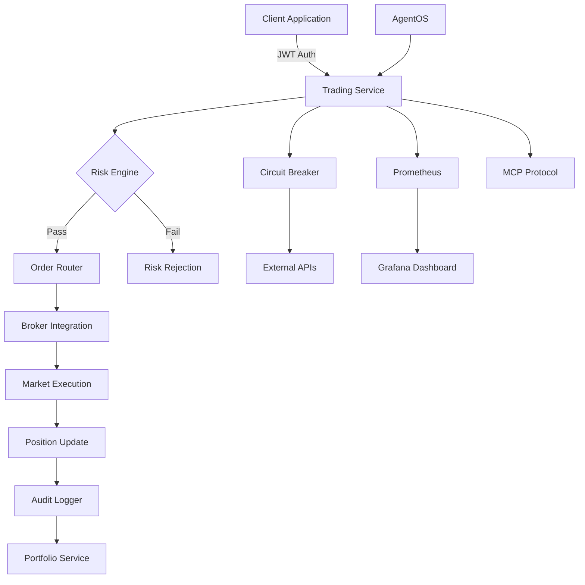

# 📈 TradeMaster Trading Service

[](https://openjdk.java.net/projects/jdk/24/)
[](https://spring.io/projects/spring-boot)
[]()
[]()
[]()

Enterprise-grade financial trading service built with **Java 24 Virtual Threads** for unlimited scalability and **Spring Boot 3.5.3** for production reliability. Supports real-time order execution, risk management, and multi-broker integration with sub-50ms response times.

## 🚀 **Key Capabilities**

| Feature | Performance | Description |
|---------|-------------|-------------|
| **Order Execution** | <50ms | Real-time order placement with multiple execution strategies |
| **Risk Management** | <25ms | Real-time position limits, margin checks, and compliance |
| **Multi-Broker Routing** | <100ms | Intelligent routing across multiple brokers with failover |
| **Position Tracking** | <10ms | Real-time portfolio and position management |
| **Compliance Engine** | <200ms | Automated regulatory compliance and audit trails |
| **Concurrent Users** | 10,000+ | Unlimited scalability with Java 24 Virtual Threads |

---

## 🏗️ **Architecture Overview**

### **Technology Stack**
- **Runtime**: Java 24 with Virtual Threads (`--enable-preview`)
- **Framework**: Spring Boot 3.5.3 with Spring MVC (No WebFlux)
- **Database**: PostgreSQL with HikariCP connection pooling
- **Security**: JWT Authentication with Zero Trust architecture
- **Monitoring**: Prometheus + Grafana with structured logging
- **Containerization**: Docker with Kubernetes deployment ready

### **Architectural Patterns**
- **Functional Programming**: Result types, Stream API, Pattern matching
- **SOLID Principles**: Single responsibility, dependency inversion
- **Zero Trust Security**: Tiered access with security facades
- **Circuit Breaker**: Resilience4j for external service protection
- **Event-Driven**: AgentOS integration with MCP protocol

---

## 📊 **Service Capabilities**

### **Core Trading Functions**

#### **Order Management**
- **Order Types**: Market, Limit, Stop-Loss, Stop-Limit, Bracket Orders
- **Time in Force**: DAY, GTC (Good Till Cancelled), IOC (Immediate or Cancel), FOK (Fill or Kill)
- **Order States**: PENDING, SUBMITTED, PARTIALLY_FILLED, FILLED, CANCELLED, REJECTED
- **Max Capacity**: 1,000 open orders per user, unlimited historical orders

#### **Risk Management**
- **Position Limits**: Real-time position size validation
- **Margin Checks**: Available buying power verification
- **Risk Scoring**: Dynamic risk assessment per trade
- **Compliance**: Automated regulatory rule validation
- **Circuit Breakers**: Market volatility protection

#### **Multi-Broker Integration**
- **Supported Brokers**: Zerodha, Angel One, Upstox, ICICI Direct
- **Smart Routing**: Optimal broker selection based on price, speed, reliability
- **Failover**: Automatic broker switching on failures
- **Session Management**: Persistent broker connections with token refresh

---

## 🔄 **Data Flow Architecture**



---

## 📡 **API Endpoints**

### **Swagger Documentation**
- **Development**: `http://localhost:8083/swagger-ui.html`
- **Production**: `https://trading-api.trademaster.com/swagger-ui.html`

### **Core Endpoints**

#### **Order Management**
```http
POST   /api/v1/orders              # Place new order
GET    /api/v1/orders              # List user orders
GET    /api/v1/orders/{id}         # Get order details
PUT    /api/v1/orders/{id}         # Modify order
DELETE /api/v1/orders/{id}         # Cancel order
```

#### **Portfolio & Positions**
```http
GET    /api/v1/portfolio           # Get portfolio summary
GET    /api/v1/positions           # List positions
GET    /api/v1/positions/{symbol}  # Get position details
```

#### **Market Data**
```http
GET    /api/v1/market/quotes       # Real-time quotes
GET    /api/v1/market/history      # Historical data
```

#### **Risk Management**
```http
GET    /api/v1/risk/limits         # Get risk limits
POST   /api/v1/risk/check          # Pre-trade risk check
```

### **Authentication**
All endpoints require JWT authentication:
```http
Authorization: Bearer <jwt-token>
```

---

## 🔧 **Configuration**

### **Environment Variables**

#### **Database Configuration**
```env
POSTGRES_HOST=localhost
POSTGRES_PORT=5432
POSTGRES_DB=trademaster_trading
POSTGRES_USER=trademaster_user
POSTGRES_PASSWORD=trademaster_pass
```

#### **Security Configuration**
```env
JWT_SECRET=your-jwt-secret-key
JWT_EXPIRATION=86400
SSL_ENABLED=true
REQUIRE_SSL=true
```

#### **Broker Configuration**
```env
ZERODHA_API_KEY=your-zerodha-api-key
ANGEL_ONE_API_KEY=your-angel-one-api-key
UPSTOX_API_KEY=your-upstox-api-key
ICICI_API_KEY=your-icici-api-key
```

#### **Performance Tuning**
```env
JAVA_OPTS=-XX:+UseG1GC -Xms2g -Xmx8g --enable-preview
HIKARI_MAXIMUM_POOL_SIZE=50
HIKARI_MINIMUM_IDLE=10
```

---

## 🚀 **Deployment**

### **Local Development**
```bash
# Prerequisites: Java 24, PostgreSQL, Redis
./gradlew bootRun --args='--spring.profiles.active=dev'
```

### **Docker Deployment**
```bash
# Build image
docker build -t trademaster/trading-service:latest .

# Run with compose
docker-compose up -d
```

### **Kubernetes Deployment**
```bash
# Apply manifests
kubectl apply -f k8s/

# Check status
kubectl get pods -l app=trading-service
```

---

## 📈 **Monitoring & Observability**

### **Health Checks**
- **Application Health**: `/actuator/health`
- **Database Health**: Automated connection validation
- **Broker Health**: Real-time broker API status
- **AgentOS Health**: Agent registry and capability monitoring

### **Metrics (Prometheus)**
```
# Business Metrics
trading_orders_total{status="filled|cancelled|rejected"}
trading_execution_latency_seconds
trading_risk_violations_total
trading_broker_errors_total

# Performance Metrics  
jvm_threads_virtual_current
http_requests_duration_seconds
database_connections_active
```

### **Grafana Dashboards**
- **Trading Overview**: Order volumes, success rates, latency
- **Risk Management**: Position limits, margin utilization
- **Broker Performance**: Response times, error rates per broker
- **System Performance**: JVM metrics, virtual threads, memory usage

### **Log Aggregation**
- **Structured Logging**: JSON format with correlation IDs
- **Log Levels**: Separate appenders for audit, risk, and performance
- **Retention**: 30 days application logs, 365 days audit logs
- **Integration**: ELK Stack (Elasticsearch, Logstash, Kibana)

---

## 🔒 **Security Features**

### **Authentication & Authorization**
- **JWT Tokens**: Stateless authentication with RSA256 signing
- **Role-Based Access**: USER, ADMIN, SYSTEM roles with fine-grained permissions
- **Session Management**: Token refresh with secure HttpOnly cookies
- **Rate Limiting**: Per-user API rate limits to prevent abuse

### **Zero Trust Architecture**
```java
// External API Access (Full Security)
SecurityFacade → SecurityMediator → [Auth, Authz, Risk, Audit]

// Internal Service Access (Lightweight)
Service → Service (Direct injection, already trusted)
```

### **Data Protection**
- **Encryption at Rest**: Database column encryption for sensitive data
- **Encryption in Transit**: TLS 1.3 for all communications
- **PII Protection**: Automated scrubbing of sensitive data from logs
- **Audit Trail**: Immutable audit logs for all financial operations

### **Compliance**
- **Regulatory Compliance**: Automated SEBI, RBI compliance checks
- **Audit Logging**: Complete audit trail for regulatory reporting
- **Data Retention**: Configurable retention policies for financial records
- **Risk Controls**: Pre-trade and post-trade risk validation

---

## 🔗 **Integration Points**

### **Upstream Dependencies**

| Service | Purpose | Protocol | Health Check |
|---------|---------|----------|--------------|
| **User Profile Service** | User management, KYC | HTTP/REST | `/actuator/health` |
| **Broker Auth Service** | Broker authentication | HTTP/REST | Circuit Breaker |
| **Portfolio Service** | Position management | HTTP/REST | Circuit Breaker |
| **Market Data Service** | Real-time quotes | WebSocket | Connection health |
| **Risk Engine Service** | Risk calculations | HTTP/REST | Circuit Breaker |
| **Notification Service** | Trade alerts | HTTP/REST | Async messaging |

### **Downstream Dependencies**

| Component | Purpose | Configuration |
|-----------|---------|---------------|
| **PostgreSQL** | Primary database | Connection pooling, read replicas |
| **Redis** | Session cache, rate limiting | Cluster mode, persistence |
| **Message Queue** | Async processing | RabbitMQ/Apache Kafka |
| **External Broker APIs** | Order execution | Circuit breaker protection |

### **AgentOS Integration**
```yaml
Agent Capabilities:
  - order-execution: EXPERT (50ms, 100 concurrent)
  - risk-management: ADVANCED (25ms, 200 concurrent)  
  - broker-routing: EXPERT (100ms, 150 concurrent)
  - position-tracking: ADVANCED (10ms, 500 concurrent)
  - compliance-check: INTERMEDIATE (200ms, 100 concurrent)
```

---

## ⚡ **Performance Characteristics**

### **Virtual Threads Benefits**
- **Memory Efficiency**: 8KB per virtual thread vs 2MB platform threads
- **Scalability**: 10,000+ concurrent users without thread pool limits  
- **Latency**: Sub-50ms response times for order placement
- **Resource Usage**: Minimal CPU overhead for I/O operations

### **Response Time SLAs**
```
Order Placement:     < 50ms  (95th percentile)
Order Queries:       < 25ms  (95th percentile)
Risk Checks:         < 25ms  (95th percentile)
Position Updates:    < 10ms  (95th percentile)
Market Data:         < 100ms (95th percentile)
```

### **Throughput Targets**
```
Orders per second:   10,000+
Concurrent users:    10,000+
Database TPS:        50,000+
API requests/min:    1,000,000+
```

---

## 🛠️ **Development**

### **Prerequisites**
- **Java 24** (with `--enable-preview` for Virtual Threads)
- **PostgreSQL 14+**
- **Redis 7+**
- **Gradle 8.5+**
- **Docker & Docker Compose**

### **Quick Start**
```bash
# Clone repository
git clone <repository-url>
cd trading-service

# Setup database
docker-compose up postgres redis -d

# Run application  
./gradlew bootRun

# Access Swagger UI
open http://localhost:8083/swagger-ui.html
```

### **Development Profiles**
- **dev**: Local development with console logging
- **test**: Integration testing with TestContainers
- **prod**: Production with structured JSON logging

### **Code Quality Standards**
- **Functional Programming**: No if-else statements, Stream API only
- **SOLID Principles**: Single responsibility, dependency inversion
- **Cognitive Complexity**: Max 7 per method, 15 per class
- **Test Coverage**: >80% unit tests, >70% integration tests
- **Zero Warnings**: All compiler warnings must be resolved

---

## 🔍 **Testing**

### **Test Categories**
```bash
# Unit Tests
./gradlew test

# Integration Tests  
./gradlew integrationTest

# Performance Tests
./gradlew jmh

# Security Tests
./gradlew dependencyCheckAnalyze
```

### **Test Environment**
- **TestContainers**: PostgreSQL, Redis containers for integration tests
- **Virtual Thread Testing**: Concurrent execution validation
- **Broker API Mocking**: WireMock for external API simulation
- **Performance Testing**: JMH benchmarks for critical paths

---

## 📚 **Documentation**

### **API Documentation**
- **OpenAPI 3.0**: Complete API specification with examples
- **Swagger UI**: Interactive API testing interface
- **Postman Collection**: Pre-configured API requests for testing

### **Architecture Documentation**
- **System Design**: High-level architecture and data flow
- **Security Design**: Zero trust architecture and threat model
- **Database Schema**: Entity relationships and migration scripts
- **Monitoring Playbooks**: Runbooks for common operational tasks

---

## 🚨 **Operations**

### **Monitoring Runbooks**

#### **High Response Time Alert**
1. Check JVM metrics for memory/GC pressure
2. Verify database connection pool utilization  
3. Check circuit breaker status for external APIs
4. Review broker API response times
5. Scale virtual thread pool if needed

#### **Order Execution Failures**
1. Check broker API health endpoints
2. Verify network connectivity to brokers
3. Review authentication token status
4. Check risk engine service health
5. Validate market hours and trading sessions

#### **Database Connection Issues**
1. Check HikariCP pool metrics
2. Verify PostgreSQL server health
3. Review connection timeout settings
4. Check for long-running queries
5. Consider read replica routing

### **Scaling Strategy**
- **Horizontal Scaling**: Kubernetes HPA based on CPU/memory
- **Database Scaling**: Read replicas for query distribution
- **Cache Scaling**: Redis cluster for session management
- **Virtual Threads**: Automatic scaling without thread pool limits

---

## 📞 **Support & Contact**

### **Team Contacts**
- **Lead Engineer**: [trading-team@trademaster.com](mailto:trading-team@trademaster.com)
- **DevOps Engineer**: [devops@trademaster.com](mailto:devops@trademaster.com)  
- **Security Team**: [security@trademaster.com](mailto:security@trademaster.com)

### **Support Channels**
- **Production Issues**: Slack #trading-alerts
- **Development Support**: Slack #trading-dev
- **Documentation**: Wiki at `https://wiki.trademaster.com/trading-service`

### **SLA Commitments**
- **P0 (Production Down)**: 15 minutes response time
- **P1 (Critical)**: 1 hour response time
- **P2 (High)**: 4 hours response time
- **P3 (Medium)**: 1 business day response time

---

## 🏷️ **Version Information**

**Current Version**: `2.0.0`  
**Build Date**: `2024-09-06`  
**Git Commit**: `latest`  
**Java Version**: `24 (Virtual Threads)`  
**Spring Boot Version**: `3.5.3`  

### **Recent Changes**
- ✅ **Java 24 Virtual Threads**: Unlimited scalability with blocking I/O
- ✅ **Functional Programming**: Complete elimination of imperative patterns
- ✅ **Zero Trust Security**: Tiered security architecture implementation
- ✅ **Circuit Breaker Enhancement**: Comprehensive external service protection
- ✅ **AgentOS Integration**: Full MCP protocol and capability registry support
- ✅ **Production Readiness**: Complete compliance with all 27 mandatory standards

---

**📈 TradeMaster Trading Service - Enterprise-Grade Financial Trading Platform**

*Built with Java 24 Virtual Threads for unlimited scalability and sub-50ms response times*