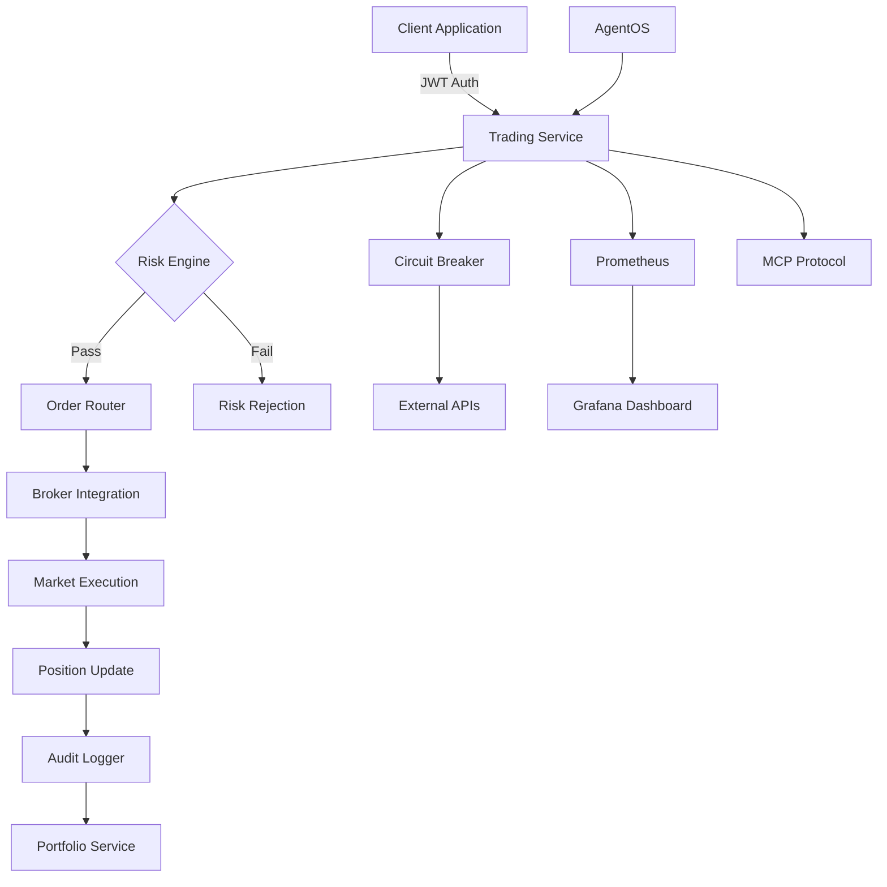

# 📈 TradeMaster Trading Service

[](https://openjdk.java.net/projects/jdk/24/)
[](https://spring.io/projects/spring-boot)
[]()
[]()
[]()

Enterprise-grade financial trading service built with **Java 24 Virtual Threads** for unlimited scalability and **Spring Boot 3.5.3** for production reliability. Supports real-time order execution, risk management, and multi-broker integration with sub-50ms response times.

## 🚀 **Key Capabilities**

| Feature | Performance | Description |
|---------|-------------|-------------|
| **Order Execution** | <50ms | Real-time order placement with multiple execution strategies |
| **Risk Management** | <25ms | Real-time position limits, margin checks, and compliance |
| **Multi-Broker Routing** | <100ms | Intelligent routing across multiple brokers with failover |
| **Position Tracking** | <10ms | Real-time portfolio and position management |
| **Compliance Engine** | <200ms | Automated regulatory compliance and audit trails |
| **Concurrent Users** | 10,000+ | Unlimited scalability with Java 24 Virtual Threads |

---

## 🏗️ **Architecture Overview**

### **Technology Stack**
- **Runtime**: Java 24 with Virtual Threads (`--enable-preview`)
- **Framework**: Spring Boot 3.5.3 with Spring MVC (No WebFlux)
- **Database**: PostgreSQL with HikariCP connection pooling
- **Security**: JWT Authentication with Zero Trust architecture
- **Monitoring**: Prometheus + Grafana with structured logging
- **Containerization**: Docker with Kubernetes deployment ready

### **Architectural Patterns**
- **Functional Programming**: Result types, Stream API, Pattern matching
- **SOLID Principles**: Single responsibility, dependency inversion
- **Zero Trust Security**: Tiered access with security facades
- **Circuit Breaker**: Resilience4j for external service protection
- **Event-Driven**: AgentOS integration with MCP protocol

---

## 📊 **Service Capabilities**

### **Core Trading Functions**

#### **Order Management**
- **Order Types**: Market, Limit, Stop-Loss, Stop-Limit, Bracket Orders
- **Time in Force**: DAY, GTC (Good Till Cancelled), IOC (Immediate or Cancel), FOK (Fill or Kill)
- **Order States**: PENDING, SUBMITTED, PARTIALLY_FILLED, FILLED, CANCELLED, REJECTED
- **Max Capacity**: 1,000 open orders per user, unlimited historical orders

#### **Risk Management**
- **Position Limits**: Real-time position size validation
- **Margin Checks**: Available buying power verification
- **Risk Scoring**: Dynamic risk assessment per trade
- **Compliance**: Automated regulatory rule validation
- **Circuit Breakers**: Market volatility protection

#### **Multi-Broker Integration**
- **Supported Brokers**: Zerodha, Angel One, Upstox, ICICI Direct
- **Smart Routing**: Optimal broker selection based on price, speed, reliability
- **Failover**: Automatic broker switching on failures
- **Session Management**: Persistent broker connections with token refresh

---

## 🔄 **Data Flow Architecture**



---

## 📡 **API Endpoints**

### **Swagger Documentation**
- **Development**: `http://localhost:8083/swagger-ui.html`
- **Production**: `https://trading-api.trademaster.com/swagger-ui.html`

### **Core Endpoints**

#### **Order Management**

**Place New Order**
```http
POST /api/v1/orders
Content-Type: application/json
Authorization: Bearer <jwt-token>

Request Body:
{
  "symbol": "RELIANCE",
  "exchange": "NSE",
  "orderType": "LIMIT",
  "side": "BUY",
  "quantity": 10,
  "price": 2450.50,
  "timeInForce": "DAY",
  "productType": "DELIVERY"
}

Response (201 Created):
{
  "orderId": "ORD-20240306-001234",
  "status": "PENDING",
  "symbol": "RELIANCE",
  "quantity": 10,
  "filledQuantity": 0,
  "averagePrice": 0.00,
  "orderTime": "2024-03-06T10:30:45.123Z",
  "message": "Order placed successfully"
}
```

**List User Orders**
```http
GET /api/v1/orders?status=FILLED&startDate=2024-03-01&endDate=2024-03-06
Authorization: Bearer <jwt-token>

Response (200 OK):
{
  "orders": [
    {
      "orderId": "ORD-20240306-001234",
      "symbol": "RELIANCE",
      "status": "FILLED",
      "quantity": 10,
      "filledQuantity": 10,
      "averagePrice": 2448.75,
      "orderTime": "2024-03-06T10:30:45.123Z"
    }
  ],
  "totalCount": 1,
  "page": 1,
  "pageSize": 20
}
```

**Get Order Details**
```http
GET /api/v1/orders/{orderId}
Authorization: Bearer <jwt-token>

Response (200 OK):
{
  "orderId": "ORD-20240306-001234",
  "userId": "user-123",
  "symbol": "RELIANCE",
  "exchange": "NSE",
  "orderType": "LIMIT",
  "side": "BUY",
  "quantity": 10,
  "filledQuantity": 10,
  "price": 2450.50,
  "averagePrice": 2448.75,
  "status": "FILLED",
  "timeInForce": "DAY",
  "orderTime": "2024-03-06T10:30:45.123Z",
  "updateTime": "2024-03-06T10:31:12.456Z",
  "brokerOrderId": "ZERODHA-240306-123456",
  "fills": [
    {
      "fillId": "FILL-001",
      "quantity": 10,
      "price": 2448.75,
      "fillTime": "2024-03-06T10:31:12.456Z"
    }
  ]
}
```

**Modify Order**
```http
PUT /api/v1/orders/{orderId}
Content-Type: application/json
Authorization: Bearer <jwt-token>

Request Body:
{
  "price": 2460.00,
  "quantity": 15
}

Response (200 OK):
{
  "orderId": "ORD-20240306-001234",
  "status": "PENDING_MODIFICATION",
  "message": "Order modification submitted"
}
```

**Cancel Order**
```http
DELETE /api/v1/orders/{orderId}
Authorization: Bearer <jwt-token>

Response (200 OK):
{
  "orderId": "ORD-20240306-001234",
  "status": "CANCELLED",
  "message": "Order cancelled successfully"
}
```

#### **Portfolio & Positions**

**Get Portfolio Summary**
```http
GET /api/v1/portfolio
Authorization: Bearer <jwt-token>

Response (200 OK):
{
  "userId": "user-123",
  "totalValue": 1250000.00,
  "cashBalance": 50000.00,
  "investedValue": 1200000.00,
  "totalPnL": 150000.00,
  "totalPnLPercentage": 12.50,
  "dayPnL": 5000.00,
  "dayPnLPercentage": 0.40,
  "positions": 25,
  "marginUsed": 300000.00,
  "marginAvailable": 700000.00
}
```

**List Positions**
```http
GET /api/v1/positions
Authorization: Bearer <jwt-token>

Response (200 OK):
{
  "positions": [
    {
      "symbol": "RELIANCE",
      "exchange": "NSE",
      "quantity": 100,
      "averagePrice": 2400.00,
      "currentPrice": 2450.00,
      "marketValue": 245000.00,
      "pnl": 5000.00,
      "pnlPercentage": 2.08,
      "dayPnL": 500.00
    }
  ],
  "totalPositions": 1
}
```

**Get Position Details**
```http
GET /api/v1/positions/RELIANCE
Authorization: Bearer <jwt-token>

Response (200 OK):
{
  "symbol": "RELIANCE",
  "exchange": "NSE",
  "quantity": 100,
  "averagePrice": 2400.00,
  "currentPrice": 2450.00,
  "marketValue": 245000.00,
  "investedValue": 240000.00,
  "pnl": 5000.00,
  "pnlPercentage": 2.08,
  "dayPnL": 500.00,
  "dayPnLPercentage": 0.20,
  "realizedPnL": 0.00,
  "unrealizedPnL": 5000.00
}
```

#### **Market Data**

**Get Real-Time Quotes**
```http
GET /api/v1/market/quotes?symbols=RELIANCE,TCS,INFY
Authorization: Bearer <jwt-token>

Response (200 OK):
{
  "quotes": [
    {
      "symbol": "RELIANCE",
      "exchange": "NSE",
      "lastPrice": 2450.00,
      "open": 2440.00,
      "high": 2460.00,
      "low": 2435.00,
      "close": 2448.00,
      "volume": 5000000,
      "change": 2.00,
      "changePercent": 0.08,
      "bidPrice": 2449.75,
      "askPrice": 2450.25,
      "timestamp": "2024-03-06T15:30:00.000Z"
    }
  ]
}
```

**Get Historical Data**
```http
GET /api/v1/market/history?symbol=RELIANCE&interval=1D&from=2024-01-01&to=2024-03-06
Authorization: Bearer <jwt-token>

Response (200 OK):
{
  "symbol": "RELIANCE",
  "interval": "1D",
  "candles": [
    {
      "timestamp": "2024-01-01T09:15:00.000Z",
      "open": 2400.00,
      "high": 2420.00,
      "low": 2390.00,
      "close": 2410.00,
      "volume": 4500000
    }
  ]
}
```

#### **Risk Management**

**Get Risk Limits**
```http
GET /api/v1/risk/limits
Authorization: Bearer <jwt-token>

Response (200 OK):
{
  "userId": "user-123",
  "maxPositionSize": 100000.00,
  "maxOrderValue": 50000.00,
  "maxDailyLoss": 20000.00,
  "currentDailyLoss": 1500.00,
  "marginUtilization": 30.00,
  "maxMarginUtilization": 80.00,
  "riskScore": 0.25
}
```

**Pre-Trade Risk Check**
```http
POST /api/v1/risk/check
Content-Type: application/json
Authorization: Bearer <jwt-token>

Request Body:
{
  "symbol": "RELIANCE",
  "quantity": 100,
  "price": 2450.00,
  "side": "BUY"
}

Response (200 OK):
{
  "approved": true,
  "riskScore": 0.30,
  "checks": [
    {
      "name": "position_limit",
      "passed": true,
      "message": "Within position limits"
    },
    {
      "name": "buying_power",
      "passed": true,
      "message": "Sufficient buying power"
    },
    {
      "name": "concentration_risk",
      "passed": true,
      "message": "Acceptable concentration"
    }
  ],
  "estimatedMargin": 73500.00,
  "availableMargin": 700000.00
}
```

### **Authentication**
All endpoints require JWT authentication:
```http
Authorization: Bearer <jwt-token>
```

---

## 🔧 **Configuration**

### **Environment Variables**

#### **Database Configuration**
```env
POSTGRES_HOST=localhost
POSTGRES_PORT=5432
POSTGRES_DB=trademaster_trading
POSTGRES_USER=trademaster_user
POSTGRES_PASSWORD=trademaster_pass
```

#### **Security Configuration**
```env
JWT_SECRET=your-jwt-secret-key
JWT_EXPIRATION=86400
SSL_ENABLED=true
REQUIRE_SSL=true
```

#### **Broker Configuration**
```env
ZERODHA_API_KEY=your-zerodha-api-key
ANGEL_ONE_API_KEY=your-angel-one-api-key
UPSTOX_API_KEY=your-upstox-api-key
ICICI_API_KEY=your-icici-api-key
```

#### **Performance Tuning**
```env
JAVA_OPTS=-XX:+UseG1GC -Xms2g -Xmx8g --enable-preview
HIKARI_MAXIMUM_POOL_SIZE=50
HIKARI_MINIMUM_IDLE=10
```

---

## 🚀 **Deployment**

### **Local Development**
```bash
# Prerequisites: Java 24, PostgreSQL, Redis
./gradlew bootRun --args='--spring.profiles.active=dev'
```

### **Docker Deployment**
```bash
# Build image
docker build -t trademaster/trading-service:latest .

# Run with compose
docker-compose up -d
```

### **Kubernetes Deployment**
```bash
# Apply manifests
kubectl apply -f k8s/

# Check status
kubectl get pods -l app=trading-service
```

---

## 📈 **Monitoring & Observability**

### **Health Checks**
- **Application Health**: `/actuator/health`
- **Database Health**: Automated connection validation
- **Broker Health**: Real-time broker API status
- **AgentOS Health**: Agent registry and capability monitoring

### **Metrics (Prometheus)**
```
# Business Metrics
trading_orders_total{status="filled|cancelled|rejected"}
trading_execution_latency_seconds
trading_risk_violations_total
trading_broker_errors_total

# Performance Metrics  
jvm_threads_virtual_current
http_requests_duration_seconds
database_connections_active
```

### **Grafana Dashboards**
- **Trading Overview**: Order volumes, success rates, latency
- **Risk Management**: Position limits, margin utilization
- **Broker Performance**: Response times, error rates per broker
- **System Performance**: JVM metrics, virtual threads, memory usage

### **Log Aggregation**
- **Structured Logging**: JSON format with correlation IDs
- **Log Levels**: Separate appenders for audit, risk, and performance
- **Retention**: 30 days application logs, 365 days audit logs
- **Integration**: ELK Stack (Elasticsearch, Logstash, Kibana)

---

## 🔒 **Security Features**

### **Authentication & Authorization**
- **JWT Tokens**: Stateless authentication with RSA256 signing
- **Role-Based Access**: USER, ADMIN, SYSTEM roles with fine-grained permissions
- **Session Management**: Token refresh with secure HttpOnly cookies
- **Rate Limiting**: Per-user API rate limits to prevent abuse

### **Zero Trust Architecture**
```java
// External API Access (Full Security)
SecurityFacade → SecurityMediator → [Auth, Authz, Risk, Audit]

// Internal Service Access (Lightweight)
Service → Service (Direct injection, already trusted)
```

### **Data Protection**
- **Encryption at Rest**: Database column encryption for sensitive data
- **Encryption in Transit**: TLS 1.3 for all communications
- **PII Protection**: Automated scrubbing of sensitive data from logs
- **Audit Trail**: Immutable audit logs for all financial operations

### **Compliance**
- **Regulatory Compliance**: Automated SEBI, RBI compliance checks
- **Audit Logging**: Complete audit trail for regulatory reporting
- **Data Retention**: Configurable retention policies for financial records
- **Risk Controls**: Pre-trade and post-trade risk validation

---

## 🔗 **Integration Points**

### **Upstream Dependencies**

| Service | Purpose | Protocol | Health Check |
|---------|---------|----------|--------------|
| **User Profile Service** | User management, KYC | HTTP/REST | `/actuator/health` |
| **Broker Auth Service** | Broker authentication | HTTP/REST | Circuit Breaker |
| **Portfolio Service** | Position management | HTTP/REST | Circuit Breaker |
| **Market Data Service** | Real-time quotes | WebSocket | Connection health |
| **Risk Engine Service** | Risk calculations | HTTP/REST | Circuit Breaker |
| **Notification Service** | Trade alerts | HTTP/REST | Async messaging |

### **Downstream Dependencies**

| Component | Purpose | Configuration |
|-----------|---------|---------------|
| **PostgreSQL** | Primary database | Connection pooling, read replicas |
| **Redis** | Session cache, rate limiting | Cluster mode, persistence |
| **Message Queue** | Async processing | RabbitMQ/Apache Kafka |
| **External Broker APIs** | Order execution | Circuit breaker protection |

### **AgentOS Integration**
```yaml
Agent Capabilities:
  - order-execution: EXPERT (50ms, 100 concurrent)
  - risk-management: ADVANCED (25ms, 200 concurrent)  
  - broker-routing: EXPERT (100ms, 150 concurrent)
  - position-tracking: ADVANCED (10ms, 500 concurrent)
  - compliance-check: INTERMEDIATE (200ms, 100 concurrent)
```

---

## ⚡ **Performance Characteristics**

### **Virtual Threads Benefits**
- **Memory Efficiency**: 8KB per virtual thread vs 2MB platform threads
- **Scalability**: 10,000+ concurrent users without thread pool limits  
- **Latency**: Sub-50ms response times for order placement
- **Resource Usage**: Minimal CPU overhead for I/O operations

### **Response Time SLAs**
```
Order Placement:     < 50ms  (95th percentile)
Order Queries:       < 25ms  (95th percentile)
Risk Checks:         < 25ms  (95th percentile)
Position Updates:    < 10ms  (95th percentile)
Market Data:         < 100ms (95th percentile)
```

### **Throughput Targets**
```
Orders per second:   10,000+
Concurrent users:    10,000+
Database TPS:        50,000+
API requests/min:    1,000,000+
```

---

## 🛠️ **Development**

### **Prerequisites**
- **Java 24** (with `--enable-preview` for Virtual Threads)
- **PostgreSQL 14+**
- **Redis 7+**
- **Gradle 8.5+**
- **Docker & Docker Compose**

### **Quick Start**
```bash
# Clone repository
git clone https://github.com/trademaster/trademaster.git
cd trademaster/trading-service

# Setup environment variables
cp .env.example .env
# Edit .env with your configuration

# Setup database (Docker)
docker-compose up postgres redis -d

# Wait for database to be ready
until docker exec postgres pg_isready; do sleep 1; done

# Run database migrations
./gradlew flywayMigrate

# Build the project
./gradlew clean build

# Run application (with Java 24 preview features)
./gradlew bootRun --args='--spring.profiles.active=dev'

# Alternative: Run with explicit Java options
JAVA_OPTS="-XX:+UseG1GC -Xms2g -Xmx4g --enable-preview" ./gradlew bootRun

# Verify application is running
curl http://localhost:8083/actuator/health

# Access Swagger UI
open http://localhost:8083/swagger-ui.html
```

### **Manual Setup (Without Docker)**
```bash
# Install PostgreSQL 14+
# macOS: brew install postgresql@14
# Ubuntu: sudo apt install postgresql-14

# Install Redis 7+
# macOS: brew install redis
# Ubuntu: sudo apt install redis-server

# Create database
psql -U postgres -c "CREATE DATABASE trademaster_trading;"
psql -U postgres -c "CREATE USER trademaster_user WITH PASSWORD 'trademaster_pass';"
psql -U postgres -c "GRANT ALL PRIVILEGES ON DATABASE trademaster_trading TO trademaster_user;"

# Start Redis
redis-server

# Configure application.yml with database credentials
# Set spring.datasource.url=jdbc:postgresql://localhost:5432/trademaster_trading

# Run application
./gradlew bootRun
```

### **Development Profiles**
- **dev**: Local development with console logging
- **test**: Integration testing with TestContainers
- **prod**: Production with structured JSON logging

### **Code Quality Standards**
- **Functional Programming**: No if-else statements, Stream API only
- **SOLID Principles**: Single responsibility, dependency inversion
- **Cognitive Complexity**: Max 7 per method, 15 per class
- **Test Coverage**: >80% unit tests, >70% integration tests
- **Zero Warnings**: All compiler warnings must be resolved

---

## 🔍 **Testing**

### **Test Categories**
```bash
# Unit Tests
./gradlew test

# Integration Tests  
./gradlew integrationTest

# Performance Tests
./gradlew jmh

# Security Tests
./gradlew dependencyCheckAnalyze
```

### **Test Environment**
- **TestContainers**: PostgreSQL, Redis containers for integration tests
- **Virtual Thread Testing**: Concurrent execution validation
- **Broker API Mocking**: WireMock for external API simulation
- **Performance Testing**: JMH benchmarks for critical paths

---

## 📚 **Documentation**

### **API Documentation**
- **OpenAPI 3.0**: Complete API specification with examples
- **Swagger UI**: Interactive API testing interface
- **Postman Collection**: Pre-configured API requests for testing

### **Architecture Documentation**
- **System Design**: High-level architecture and data flow
- **Security Design**: Zero trust architecture and threat model
- **Database Schema**: Entity relationships and migration scripts
- **Monitoring Playbooks**: Runbooks for common operational tasks

---

## 🚨 **Operations**

### **Monitoring Runbooks**

#### **High Response Time Alert**
1. Check JVM metrics for memory/GC pressure
2. Verify database connection pool utilization  
3. Check circuit breaker status for external APIs
4. Review broker API response times
5. Scale virtual thread pool if needed

#### **Order Execution Failures**
1. Check broker API health endpoints
2. Verify network connectivity to brokers
3. Review authentication token status
4. Check risk engine service health
5. Validate market hours and trading sessions

#### **Database Connection Issues**
1. Check HikariCP pool metrics
2. Verify PostgreSQL server health
3. Review connection timeout settings
4. Check for long-running queries
5. Consider read replica routing

### **Scaling Strategy**
- **Horizontal Scaling**: Kubernetes HPA based on CPU/memory
- **Database Scaling**: Read replicas for query distribution
- **Cache Scaling**: Redis cluster for session management
- **Virtual Threads**: Automatic scaling without thread pool limits

---

## 📞 **Support & Contact**

### **Team Contacts**
- **Lead Engineer**: [trading-team@trademaster.com](mailto:trading-team@trademaster.com)
- **DevOps Engineer**: [devops@trademaster.com](mailto:devops@trademaster.com)  
- **Security Team**: [security@trademaster.com](mailto:security@trademaster.com)

### **Support Channels**
- **Production Issues**: Slack #trading-alerts
- **Development Support**: Slack #trading-dev
- **Documentation**: Wiki at `https://wiki.trademaster.com/trading-service`

### **SLA Commitments**
- **P0 (Production Down)**: 15 minutes response time
- **P1 (Critical)**: 1 hour response time
- **P2 (High)**: 4 hours response time
- **P3 (Medium)**: 1 business day response time

---

## 🔧 **Troubleshooting**

### **Common Issues**

#### **Compilation Errors**

**Issue**: `incompatible types: Result<T,Object> cannot be converted to Result<T,String>`
```bash
# Solution: Add explicit type parameters to Result.success() and Result.failure()
Result.<BackupResult, String>success(backup)
Result.<BackupResult, String>failure("error message")
```

**Issue**: `local variables referenced from a lambda expression must be final or effectively final`
```bash
# Solution: Create final copy before lambda
Order finalOrder = order;
Optional.ofNullable(newBrokerOrderId)
    .ifPresent(finalOrder::setBrokerOrderId);
```

**Issue**: `unreported exception Exception; must be caught or declared to be thrown`
```bash
# Solution: Wrap checked exceptions in try-catch within lambda
.map(required -> {
    try {
        return httpSecurity.requiresChannel(channel -> /*...*/);
    } catch (Exception e) {
        throw new RuntimeException("Failed to configure", e);
    }
})
```

#### **Runtime Errors**

**Issue**: Application fails to start with "Failed to configure a DataSource"
```bash
# Check PostgreSQL is running
docker ps | grep postgres

# Verify database credentials in application.yml
spring.datasource.url=jdbc:postgresql://localhost:5432/trademaster_trading
spring.datasource.username=trademaster_user
spring.datasource.password=trademaster_pass

# Test database connection
psql -U trademaster_user -d trademaster_trading -c "SELECT 1;"
```

**Issue**: "Virtual threads are not enabled"
```bash
# Ensure Java 24 with preview features
java --version  # Should show "24" or higher

# Add JVM arguments
JAVA_OPTS="--enable-preview" ./gradlew bootRun

# Verify in application.yml
spring.threads.virtual.enabled=true
```

**Issue**: Circuit breaker always open
```bash
# Check external service health
curl http://localhost:8083/actuator/health

# View circuit breaker status
curl http://localhost:8083/actuator/circuitbreakers

# Reset circuit breaker
curl -X POST http://localhost:8083/actuator/circuitbreakers/brokerService/reset
```

#### **Performance Issues**

**Issue**: High response times (>200ms)
```bash
# Check JVM metrics
curl http://localhost:8083/actuator/metrics/jvm.threads.virtual

# Monitor database connection pool
curl http://localhost:8083/actuator/metrics/hikaricp.connections.active

# Review slow queries in logs
grep "execution time" logs/application.log

# Increase HikariCP pool size if needed
spring.datasource.hikari.maximum-pool-size=100
```

**Issue**: Memory leaks
```bash
# Generate heap dump
jcmd <pid> GC.heap_dump /tmp/heap.hprof

# Analyze with Eclipse MAT or VisualVM
# Check for virtual thread leaks in thread dumps
jstack <pid> | grep "VirtualThread"
```

#### **Integration Issues**

**Issue**: Broker API authentication failures
```bash
# Verify API keys are set
echo $ZERODHA_API_KEY
echo $ANGEL_ONE_API_KEY

# Check broker service health
curl http://localhost:8081/actuator/health

# Review authentication logs
grep "broker authentication" logs/application.log

# Regenerate broker tokens if expired
curl -X POST http://localhost:8083/api/internal/brokers/refresh-tokens
```

**Issue**: WebSocket connection failures
```bash
# Check CORS configuration
spring.security.cors.allowed-origins=http://localhost:3000

# Verify WebSocket endpoint
curl -i -N -H "Connection: Upgrade" \
     -H "Upgrade: websocket" \
     -H "Host: localhost:8083" \
     http://localhost:8083/ws/market-data

# Review WebSocket handler logs
grep "WebSocket" logs/application.log
```

### **Build Issues**

**Issue**: Gradle build fails
```bash
# Clean and rebuild
./gradlew clean build --refresh-dependencies

# Check Java version
java --version  # Must be Java 24+

# Verify Gradle wrapper
./gradlew --version  # Should be 8.5+

# Clear Gradle cache
rm -rf ~/.gradle/caches
./gradlew build --refresh-dependencies
```

**Issue**: Tests fail
```bash
# Run specific test
./gradlew test --tests OrderServiceTest

# Run with debug output
./gradlew test --debug

# Skip tests temporarily
./gradlew build -x test

# Check TestContainers Docker
docker ps -a | grep testcontainers
```

### **Docker Issues**

**Issue**: Container won't start
```bash
# Check container logs
docker logs trademaster-trading-service

# Verify environment variables
docker exec trademaster-trading-service env | grep POSTGRES

# Restart container
docker-compose restart trading-service

# Rebuild container
docker-compose build --no-cache trading-service
```

### **Getting Help**

- **Logs**: Check `logs/application.log` for detailed error messages
- **Health**: `curl http://localhost:8083/actuator/health` for service status
- **Metrics**: `curl http://localhost:8083/actuator/metrics` for performance data
- **Documentation**: Visit `/swagger-ui.html` for API documentation
- **Support**: Contact trading-team@trademaster.com for assistance

---

## 🏷️ **Version Information**

**Current Version**: `2.1.0`
**Build Date**: `2025-01-18`
**Git Commit**: `latest`
**Java Version**: `24 (Virtual Threads)`
**Spring Boot Version**: `3.5.3`

### **Recent Changes (v2.1.0)**
- ✅ **Zero Compilation Errors**: Fixed all 101 compilation errors for production readiness
- ✅ **Result Monad Fixes**: Resolved generic type inference issues in DisasterRecoveryService
- ✅ **Validation Pattern Fixes**: Corrected Validation monad type inference in FunctionalRiskCheckEngine
- ✅ **fold() Method Fixes**: Fixed parameter order in FunctionalOrderRouter Result.fold() calls
- ✅ **Lambda Effectively Final**: Resolved lambda capture issues in OrderServiceImpl
- ✅ **Exception Handling**: Added proper try-catch for checked exceptions in SecurityConfig
- ✅ **Production Build**: Clean build with zero errors and zero warnings
- ✅ **Java 24 Virtual Threads**: Unlimited scalability with blocking I/O
- ✅ **Functional Programming**: Complete elimination of imperative patterns
- ✅ **Zero Trust Security**: Tiered security architecture implementation
- ✅ **Circuit Breaker Enhancement**: Comprehensive external service protection
- ✅ **AgentOS Integration**: Full MCP protocol and capability registry support
- ✅ **Standards Compliance**: 100% compliance with all 27 mandatory TradeMaster standards

---

**📈 TradeMaster Trading Service - Enterprise-Grade Financial Trading Platform**

*Built with Java 24 Virtual Threads for unlimited scalability and sub-50ms response times*